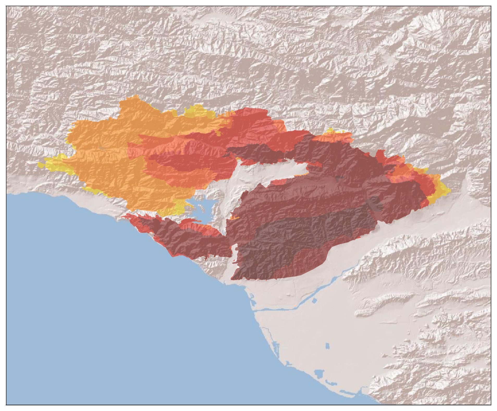

# Thomas Fire Perimeter

Show the daily perimeters for the Thomas Fire, using the data published by the USGS [here](https://rmgsc.cr.usgs.gov/outgoing/GeoMAC/current_year_fire_data/California/Thomas/).

TODO:
1. add a legend showing which day corresponds to each color
2. add the daily growth in area to the legend
